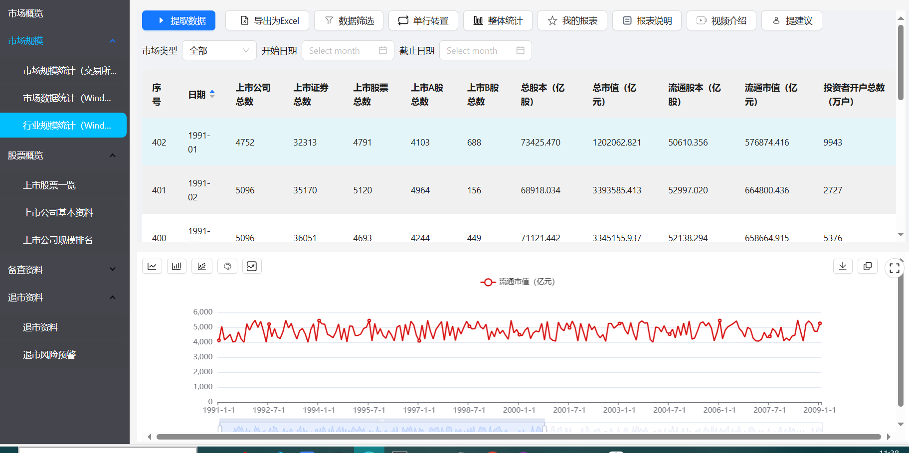
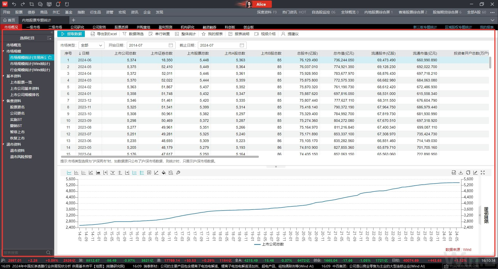
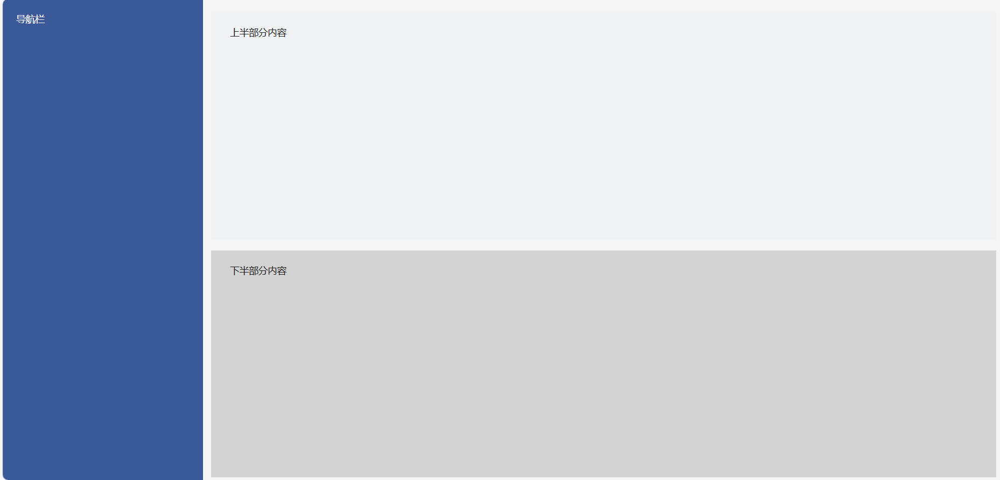
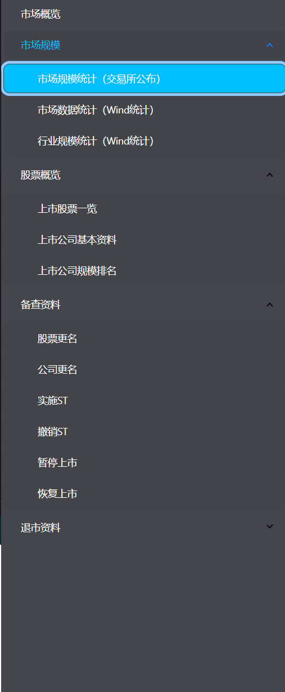
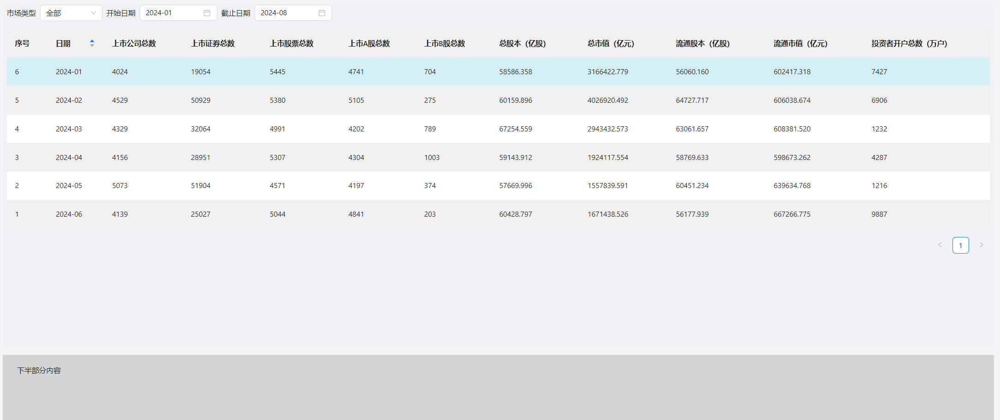

# Web小任务开发日志

> 本次的前端小任务感觉是导师为让学员回顾之前开发页面的流程和必要的页面开发本领而准备的。


## 效果展示

演示地址：https://www.lijianye.work/

代码仓库地址：



## 使用环境

| 环境    | 版本    |
| ------- | ------- |
| react   | 18.3.1  |
| node    | 20.15.0 |
| webpack | 5.64.4  |

## 事前分析



本次小任务主要实现左侧栏目树菜单，右侧上方的表格及下方的图形,可以使用grid栅格



然后再在三个区域内放三个组件就行了

# 学习时间

2024年7月3日 15：14 - 2024年 7月 3日 23：35

## 数据模拟

股市开始时间是1990年12月19日 但是这样数据太少了  没有挑战性 我们假设股市是从1990年开始的 这样我们就有了2694条数据 

用js模拟生成 存储在data.json里，本人简化了jwt使用token 请求权限获取数据库的过程，直接把这个data.json文件放到components目录下

下面是这些json数据的示例

```json
 {
    "序号": 2692,
    "日期": "1800-03",
    "上市公司总数": "5005",
    "上市证劵总数": "26401",
    "上市股票总数": "5175",
    "上市A股总数": "4107",
    "上市B股总数": "1068",
    "总股本（亿股）": "72501.874",
    "总市值（亿元）": "1149645.138",
    "流通股本（亿股）": "53095.149",
    "流通市值（亿元）": "640984.662",
    "投资者开户总数（万户）": "8232"
  },
  {
    "序号": 2693,
    "日期": "1800-02",
    "上市公司总数": "5051",
    "上市证劵总数": "48918",
    "上市股票总数": "5076",
    "上市A股总数": "4691",
    "上市B股总数": "385",
    "总股本（亿股）": "71641.353",
    "总市值（亿元）": "2020165.066",
    "流通股本（亿股）": "59348.593",
    "流通市值（亿元）": "616282.399",
    "投资者开户总数（万户）": "6680"
  },
  {
    "序号": 2694,
    "日期": "1800-01",
    "上市公司总数": "4197",
    "上市证劵总数": "39783",
    "上市股票总数": "4896",
    "上市A股总数": "4679",
    "上市B股总数": "217",
    "总股本（亿股）": "76075.690",
    "总市值（亿元）": "2664615.431",
    "流通股本（亿股）": "50075.680",
    "流通市值（亿元）": "672442.351",
    "投资者开户总数（万户）": "8626"
  }
]
```


## 三个组件的设计

### 菜单项

稍微用ant design升级了一下，让ui好看了一点点，选中二级菜单时，一级菜单也会跟着变成蔚蓝色



### 表格项

#### 遇到的困难及解决方案

表格项这部分卡了我1个多小时，原因是从日历中获取的数据对象为datejs  而且进行数据筛选的时候使用的是momentjs ，两个对象没法比较 一直不对 最后我将datejs的对象更改为momentjs，但是混用导致datepicker出现一些问题，最后找到解决方法是统一使用datejs。



实现了一些基本功能 日期选择，鼠标悬停背景色变化，

之后实现上面这一串功能


因为不知道具体的功能需求  于是我让这九个功能全部绑定了导出为excel的功能函数。

### 图项


#### 

# 感悟

经过本次小任务，本人重新温习了react开发css布局等内容，并学习使用了antdesign（以前一直用的是elementUI），遇到并解决了dayjs对象与momentjs对象不匹配无法对比的问题，但是针对一些线上表格操作的书写我还有点不太熟悉，后续我会根据网上的一些web-excel的书写来补足自己。